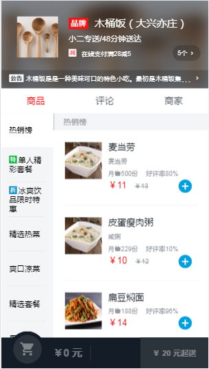

## Introduce 
```bash
My takeaway-app practice is based on the takeaway-project of ustbhuangyi/vue-sell.
This takeaway-app practice uses the MVVM framework -- Vue and the version is 2.5.16.
```
>  The source project is here: [waihoyu/sell](https://github.com/waihoyu/sell).
 If you feel this project is usefull for you ,you can fork it or star it . Thanks!

>  My github is https://github.com/waihoyu

>Effect Picture

## Build Setup

```bash
# install dependencies
npm install

# serve with hot reload at localhost:8080
npm run dev

# build for production with minification
npm run build

# build for production and view the bundle analyzer report
npm run build --report
```